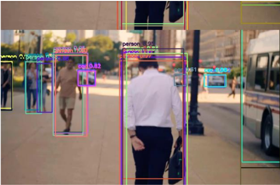

# Object-Detection-in-Video
In this project, we use YOLOv3 to detect 3 objects (human, car, bus) and draw bounding boxes around them in a video clip. First, we segment the video into frames.
Then, within each frame, we detect the objects. Finally, we assemble the frames back into a video.
 
 
__Object Detection__:
 
We classify objects with a confidence score greater than 50% as our classified objects. 
To calculate the coordinates of the bounding box corners, we utilize the center coordinates of the objects along with their height and width.
 
here is a frame of the video
 

 
 
here is the video:
 

